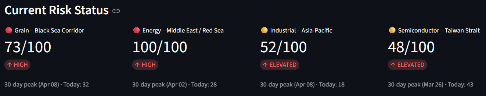
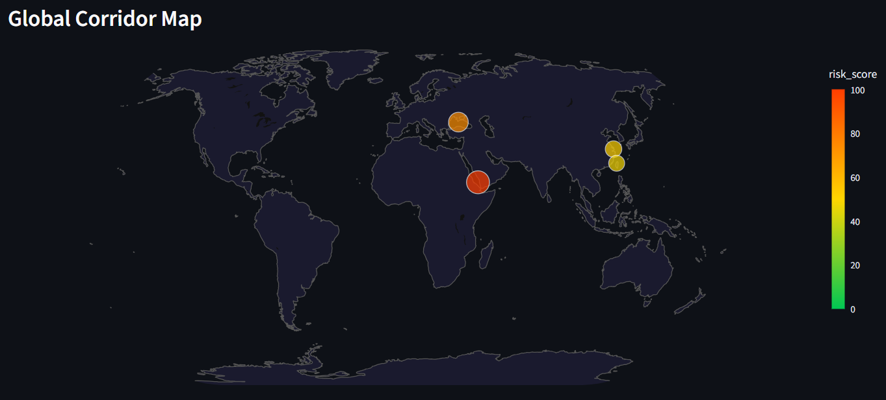
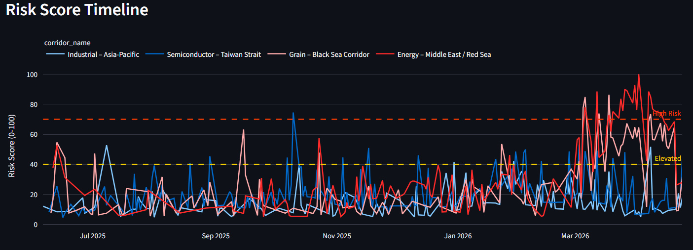
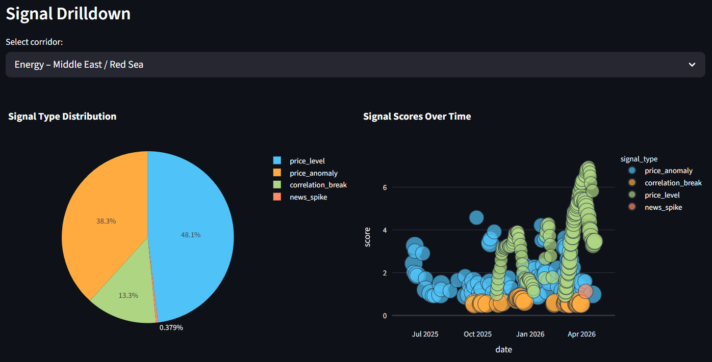
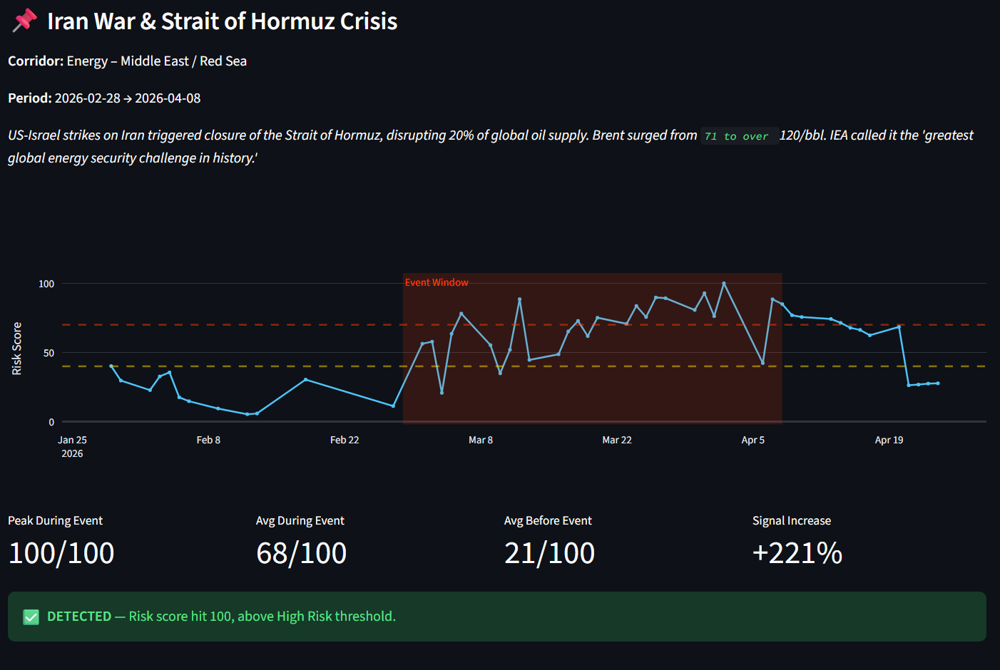
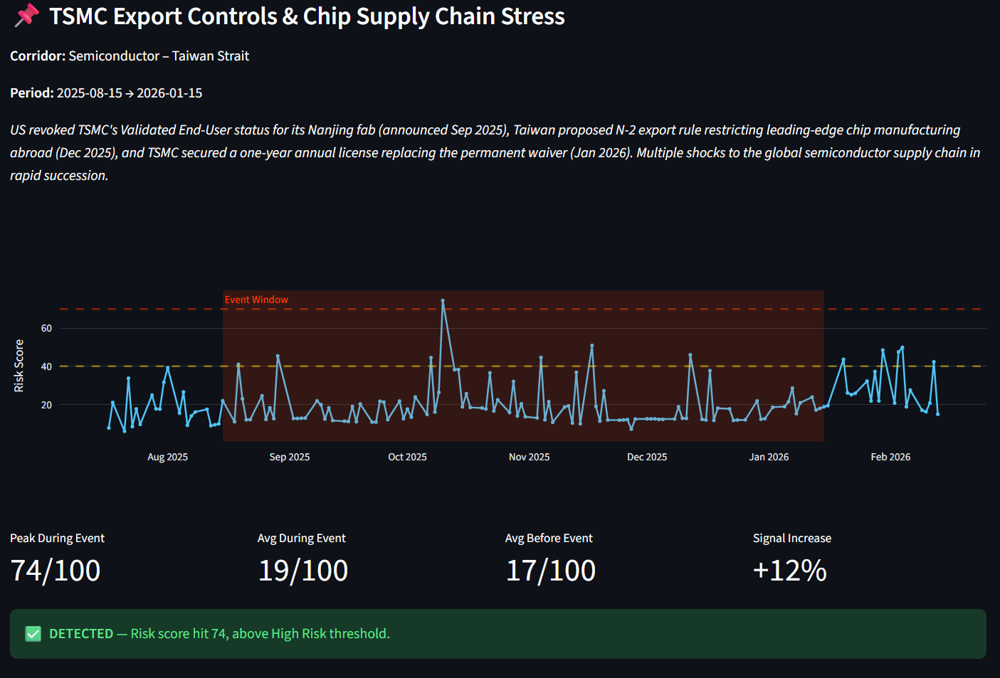

# 🛰️ Supply Chain Radar

**Financial market signals as early warning for supply chain disruptions.**


*All four monitored corridors with live risk status. Energy at 100/100 during the Iran/Hormuz crisis, Semiconductor corridor at 48/100 reflecting ongoing TSMC export control tensions.*

Supply Chain Radar monitors commodity futures, FX rates, shipping indices, and news headlines across critical global corridors — detecting supply chain stress before it hits the physical world.

## Why Financial Signals?

Markets move before the physical world. When geopolitical tensions rise, commodity futures spike days before port throughput drops. When export controls shift, TSMC's stock reacts before a single chip shipment is delayed. This system turns that financial signal into operational intelligence.

## Monitored Corridors



| Corridor | Key Signals | News Language |
|---|---|---|
| 🌾 **Grain – Black Sea** | Wheat/corn futures, UAH/USD, Brent crude | English |
| ⛽ **Energy – Middle East / Red Sea** | Brent/natural gas futures, shipping indices | English |
| 🏭 **Industrial – Asia-Pacific** | Copper, CNY/USD, Shanghai Composite | English |
| 🔬 **Semiconductor – Taiwan Strait** | TSMC, SOXX, TWD/USD, rare earth ETF (REMX) | English + 中文 |

The Semiconductor corridor uses **bilingual news intelligence** — monitoring headlines in both English and Traditional Chinese (台海危機, 台積電, 稀土出口, 晶片制裁, 半導體). This captures cross-strait supply chain signals that English-only systems miss.

## Risk Score Timeline


*The Energy corridor (red) spikes dramatically in late February 2026 with the onset of the Iran war and Strait of Hormuz crisis, hitting the High Risk threshold and sustaining elevated levels for weeks.*

## Detection Algorithms



The system runs four complementary detection algorithms:

1. **Price Anomaly Detection** — Rolling 60-day z-score on daily returns. Catches sudden shocks (e.g., Brent jumping 8% in a day).
2. **Price Level Detection** — Compares 10-day average to 6-month baseline. Catches sustained elevated prices that z-scores adapt to (e.g., Brent staying at $100+ for weeks).
3. **Correlation Breakdown** — Flags when normally-correlated assets diverge, indicating structural change.
4. **News Spike Detection** — Monitors GDELT article volume per corridor in English and Chinese.

Signals are weighted per corridor and aggregated into a composite risk score (0–100).

## Backtest Results

The system was backtested against four real-world supply chain disruptions:

### 🇮🇷 Iran War & Strait of Hormuz Crisis (Feb–Apr 2026)



US-Israel strikes on Iran triggered closure of the Strait of Hormuz, disrupting 20% of global oil supply. The system **maxed out at 100/100** with a **+221% signal increase** over the pre-event baseline. Full detection of the largest oil supply disruption in decades.

### 🇹🇼 TSMC Export Controls & Chip Supply Chain Stress (Aug 2025–Jan 2026)



US revoked TSMC's Validated End-User status for its Nanjing fab, Taiwan proposed N-2 export rule restrictions, and TSMC secured a one-year annual license replacing the permanent waiver. The system **detected the stress at 74/100** through a combination of TSMC stock movements, TWD/USD signals, and bilingual news monitoring.

### Summary

| Event | Corridor | Peak Score | Signal Increase | Result |
|---|---|---|---|---|
| Iran War / Hormuz Crisis | Energy | 100/100 | +221% | ✅ DETECTED |
| TSMC Export Controls | Semiconductor | 74/100 | +12% | ✅ DETECTED |
| Black Sea Grain Volatility | Grain | 63/100 | 0→18 | ⚠️ PARTIAL |
| US-China Tariff Escalation | Industrial | 53/100 | +22% | ⚠️ PARTIAL |

The system excels at **sudden supply shocks** (Iran war, TSMC export controls) and partially catches **sustained volatility** (grain markets). Gradual policy shifts like tariffs are a known limitation — that's where transformer-based NLP sentiment analysis would be a natural next layer.

## Architecture

```
Yahoo Finance / FRED            GDELT (EN + 中文)
         │                          │
         ▼                          ▼
   ┌──────────┐              ┌───────────┐
   │  Market   │              │   News    │
   │  Ingest   │              │  Ingest   │
   └────┬──────┘              └─────┬─────┘
        │                           │
        ▼                           ▼
   ┌──────────┐              ┌───────────┐
   │ Anomaly  │              │ News Spike│
   │ Detector │              │ Detector  │
   │ (4 types)│              │           │
   └────┬──────┘              └─────┬─────┘
        │                           │
        └───────────┬───────────────┘
                    ▼
             ┌─────────────┐
             │ Risk Mapper  │
             │ (corridors)  │
             └──────┬───────┘
                    ▼
             ┌─────────────┐
             │  Streamlit   │
             │  Dashboard   │
             └─────────────┘
```

## Quick Start

```bash
git clone https://github.com/YOUR_USERNAME/supply-chain-radar.git
cd supply-chain-radar
pip install -r requirements.txt

# Pull data
python -m data.ingest_market      # commodity futures, FX, ETFs
python -m data.ingest_news        # GDELT headlines (EN + 中文)

# Launch dashboard
streamlit run dashboard/app.py
```

Optional environment variables:
- `FRED_API_KEY` — for FRED macro indicators (free at https://fred.stlouisfed.org/docs/api/api_key.html)
- `NEWSAPI_KEY` — fallback news source if GDELT is unreliable

## Project Structure

```
supply-chain-radar/
├── config/
│   └── corridors.py          # Corridor definitions, tickers, weights, thresholds
├── data/
│   ├── ingest_market.py      # Yahoo Finance + FRED ingestion
│   └── ingest_news.py        # GDELT + NewsAPI ingestion (bilingual)
├── signals/
│   └── detector.py           # 4 detection algorithms
├── mapping/
│   └── risk_mapper.py        # Signal → corridor risk aggregation
├── dashboard/
│   └── app.py                # Streamlit dashboard (Live Monitor + Backtest)
├── docs/                     # Screenshots and documentation
├── .streamlit/
│   └── config.toml           # Dark theme
├── requirements.txt
├── run_pipeline.py           # One-command pipeline runner
└── README.md
```

## Future Improvements

- **Bloomberg integration** — Direct terminal feed for higher-frequency, higher-quality data
- **NLP sentiment classification** — Transformer-based event classification beyond volume counting
- **Physical supply chain data** — AIS vessel tracking, port throughput, inventory levels
- **Real-time alerting** — Push notifications via Slack/email when risk scores breach thresholds
- **Expanded bilingual coverage** — Japanese (日本語) for automotive supply chains, Korean (한국어) for memory chip corridors

## Built With

Python · Streamlit · Plotly · yfinance · GDELT · pandas · scikit-learn

## License

MIT — feel free to fork, modify, and build on this.

---

*A portfolio project demonstrating financial signal processing for operational intelligence, with a focus on cross-strait supply chain dynamics that English-only systems miss.*
